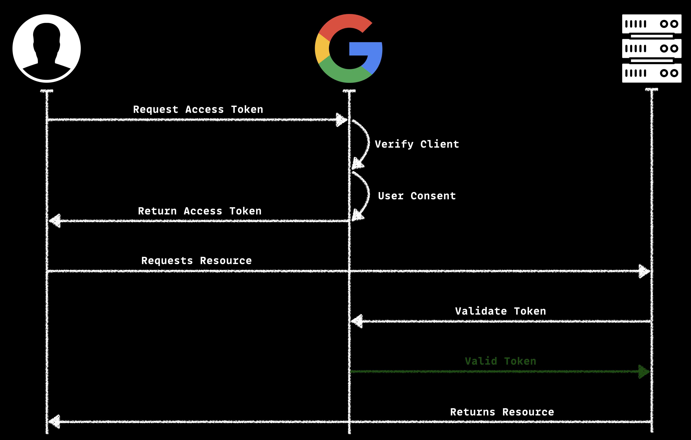
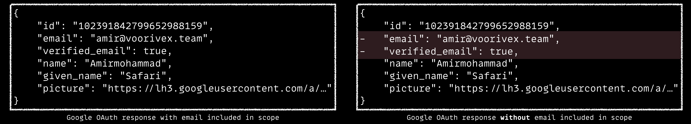
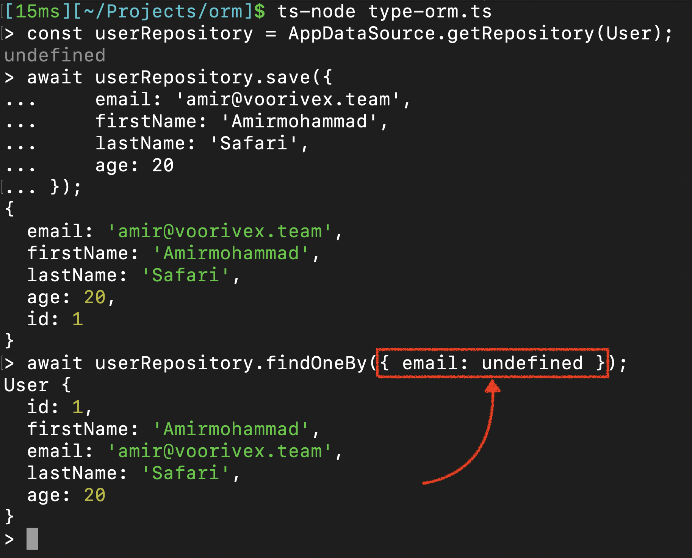
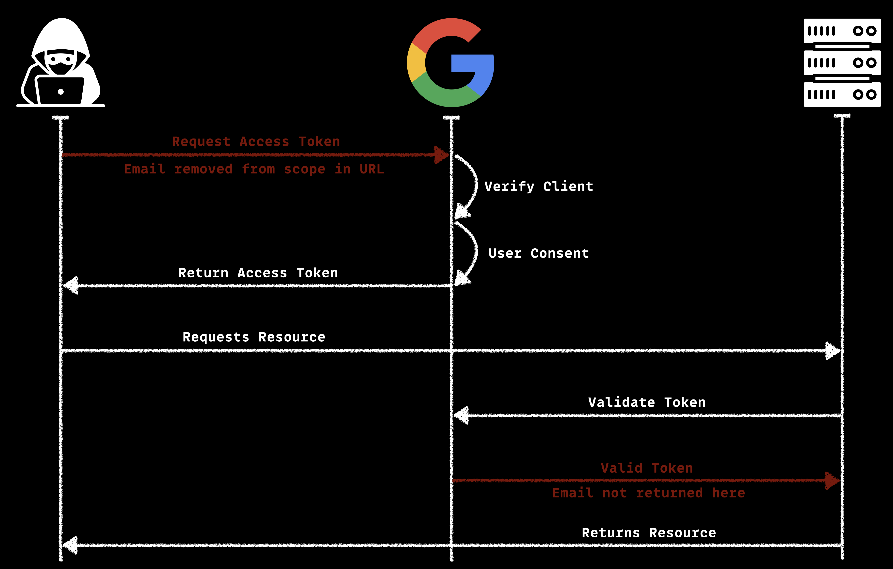

# Account Takeover via OAuth Scope Manipulation
> According to [@itscachemoney](https://twitter.com/itscachemoney), this sometimes leads to account takeover vulnerabilities. 🤯  
> [#BugBountyTip](https://twitter.com/hashtag/BugBountyTip?src=hash&ref_src=twsrc%5Etfw) [#HackWithIntigriti](https://twitter.com/hashtag/HackWithIntigriti?src=hash&ref_src=twsrc%5Etfw)  
>   
> — Intigriti (@intigriti) [August 5, 2019](https://x.com/intigriti/status/1158383750490800128?ref_src=twsrc%5Etfw)

Great tip! But how exactly does removing the email from the scope lead to an account takeover? To understand this, we need to take a closer look at how OAuth works.

When a web app uses OAuth, it sends you to a provider (like Google or Facebook). After you confirm your identity and agree to share your data, you return to the app with a token. The app then asks the provider to verify the token and sends back basic information, like your email, which the app uses to identify you.

When you allow a third-party application to access certain parts of your data, this is controlled by something called "scope", which is often found in the URL query parameters. Scope defines which specific information, like your email, you choose to share with the app. But what happens if you don’t allow the app to access your email, especially if the app uses OAuth and relies on your email for authentication?

In this case, the app tries to request the email, but the OAuth provider won’t return it because the app doesn’t have permission to access it. If error handling is well implemented in that application, the app will receive "undefined" or an empty string instead of the email.

So, how does this help us take over any account? After the web app gets the email from the OAuth provider, it searches the database for your account and then creates a session or token to log you in. But what if, instead of finding your email, the app searches the database for "undefined" or an empty string?

To understand this fully, let’s examine how the app interacts with the database. Modern web applications often use ORMs (Object-Relational Mappers). If the app queries for "undefined" using an ORM, some may return an error or find nothing. However, in some ORMs like Prisma and TypeORM, the query might match the first user in the database. This could allow the attacker to log you into that user's account.

You might wonder, if it just matches one user, how can we take over other users' accounts? Features like deleting or deactivating accounts could help you switch between users and explore their accounts.

As mentioned, the app may get "undefined" or an empty string instead of the email. We've already explained how "undefined" can lead to account takeover, but what if it's an empty string? This could allow access to any account with a blank email field. This happens when the app lets users sign up with both an email and something else, like a phone number. If they sign up this way, the email field stays empty. So, if the app gets an empty string instead of an email, we could log into an account with no email.

You don’t need to delete accounts or anything like that to switch between users. Just set the email for a user, and the next time the OAuth response has an empty email, you'll log into a different account.

In summary, I made a diagram to show this.  Basically, all you need to do is remove the email from the scope, then return to the app to see what happens. And this doesn’t only work with Facebook; it can work with any OAuth provider.

