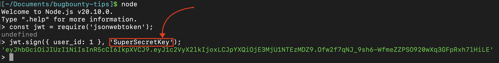
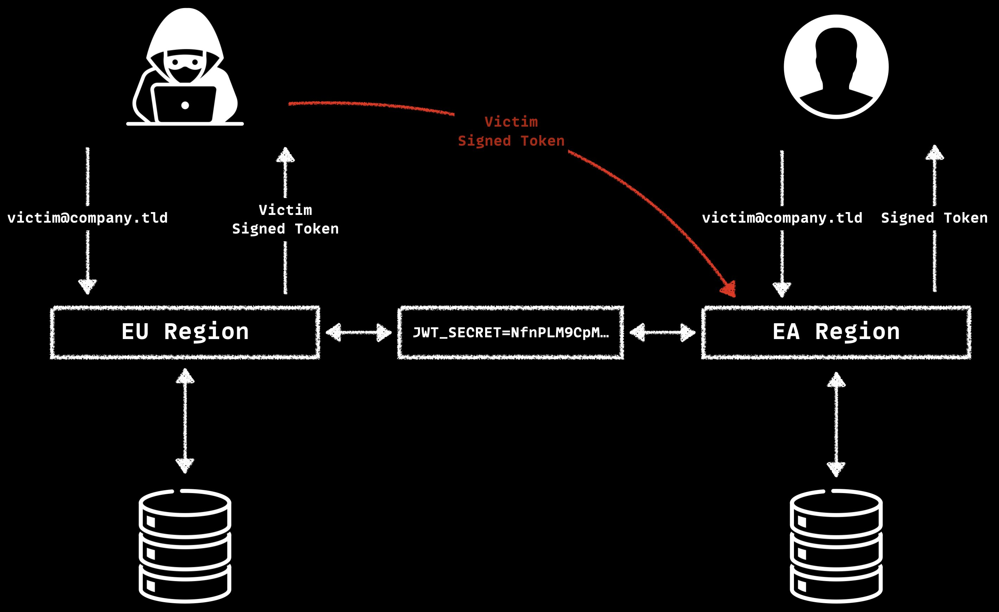
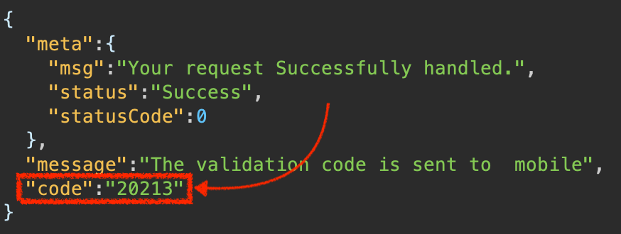

Have you seen this bug bounty tip from [@_jensec](https://x.com/_jensec)?

> [#bugbountytips](https://twitter.com/hashtag/bugbountytips?src=hash&amp;ref_src=twsrc%5Etfw) [#bugbounty](https://twitter.com/hashtag/bugbounty?src=hash&amp;ref_src=twsrc%5Etfw)  
> How I was able to find multiple critical vulnerabilities to get Full Account Takeover with the help of PlayStore and AppStore region settings.
>
> 
> 
> — Jenish Sojitra (@_jensec) [August 10, 2020](https://twitter.com/_jensec/status/1292846852010721280?ref_src=twsrc%5Etfw)

Have you considered how this issue occurs in an app? When implementing authentication mechanisms, methods such as tokens and sessions are commonly used. Let's say we have an app that uses JWT. This app relies on a secret key to sign the JWT tokens.

What if we run this app in different instances (such as in different regions)? It works fine as long as the secret keys are the same. Now, imagine a user has an account in the EA region. If an attacker registers with the same email in the EU region, a new account will be created.

But if the attacker obtains a token from the EU region and uses it in the EA region, they can access the victim's account because the secret keys are identical. This issue can also arise when companies set up dev environments, as highlighted in the [@intigriti](https://x.com/intigriti) challenge.

> Can you spot the vulnerability? 🔎  
>  
> This is a docker-compose file for the infrastructure of an application.  
> The application allows users to sign up and log in.  
> Show us how you'd take over a victim's account in the comments 👇  
>  
> The best explanation gets a 25€ SWAG voucher!🎫  
>
>   
>  
> — Intigriti (@intigriti) [December 15, 2022](https://twitter.com/intigriti/status/1603394374272000002?ref_src=twsrc%5Etfw)

As mentioned, we need to register with the victim's email and use that token in the other app. But what if the app requires email verification for registration? If we can't obtain a token, the attack will fail. However, some apps allow users to log in and retrieve tokens before verification.

Also, behavior may vary between different app instances. For example, I found a dev environment that sends OTPs to your phone and displays them in the response, unlike the production environment. This allowed me to log in with any phone number. Since the dev and production environments shared the same secret key, I was able to access production accounts using staging tokens.

I always test this method in both development and production environments, but trying it across different regions is a game changer. Huge thanks to [@_jensec](https://x.com/_jensec) for sharing this tip.